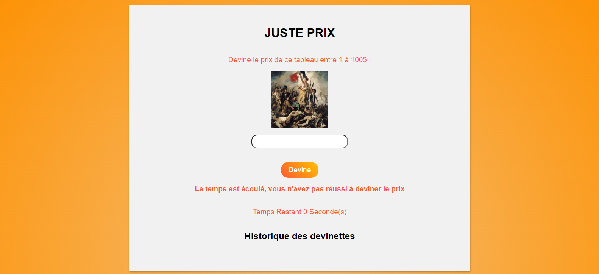

# Guess the Number Game

## Introduction

This project is a small game developed in JavaScript where the user has to guess a random number between 1 and 100 within a given time frame.

## Features

- Generation of a random number between 1 and 100.
- Time counter to limit the duration of the game.
- User input to guess the number.
- History of attempts with results.
- Victory or defeat message at the end of the allotted time.

## How to Play

1. Open the `index.html` file in your browser.
2. Enter a number between 1 and 100 in the input field.
3. Click on the "Guess" button.
4. The program will provide indications about the relationship between your guess and the generated number.
5. Repeat steps 2-4 until you find the number or the allotted time expires.

## Screenshots

*Example screenshot showing the game interface.*

*Example screenshot showing the game interface when the player loses.*

*Example screenshot showing the game interface when the player wins.*

## JavaScript Code

The JavaScript code is divided into several parts:

- **Generation of the random number:** `const nombreAleatoire = Math.floor(Math.random() * 100) + 1;`

- **Handling user input:** The `gererDevine` function processes the user's input, checks its validity, compares it with the random number, and updates the display accordingly.

- **Time decrementation:** The `decrementerTemps` function reduces the remaining time each second. An interval is set to call this function every second.

- **End of the game:** A delay of 30 seconds is set with `setTimeout` to end the game. If the user hasn't guessed the number within the allotted time, the guess button is disabled, and a defeat message is displayed.

## Installation

No specific installation is required. Simply open the `index.html` file in a modern browser.

## Author

Richard GADJENOU

Feel free to make improvements or customize the game according to your needs. Have fun!

